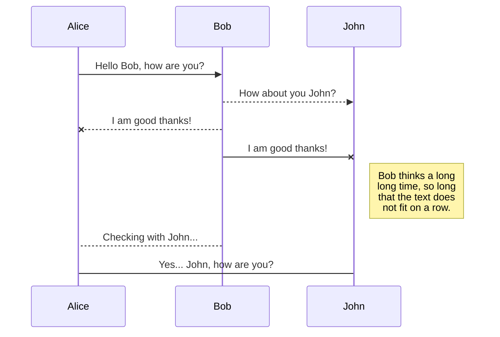
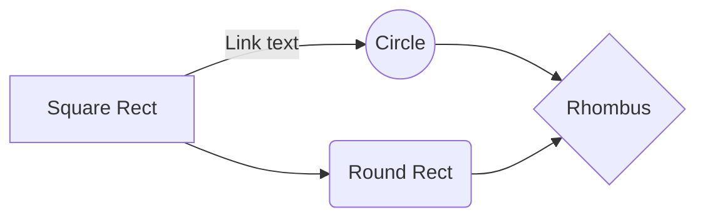

# AppviaMaps - Demo Project

This is a demo project that show how to deploy a containerised application into Appvia Wayfinder, making public cloud services easily consumable, securely and at scale.

The following instructions will walk  through getting going from scratch with Appvia Wayfinder. 

 1.  Getting an Appvia Wayfinder instance through cloud marketplace
 2. Configuring your Wayfinder instance ready for teams to start coding
	 2.1 Configure your cloud account
	 2.2. Configuring users
	 2.3 Configuring your external DNS
 3. Team workspace setup
	 3.1. Creating a Workspace
	 3.2 Creating a cluster plan
	 3.3 Create a Kuernetes cluster
4. Deploy your application
	4.1 Build the frontend container
	4.2 Build the backend services container
	4.3 Create the Kubernetes configuration files
		4.3.1 deployment.yaml
		4.3.2 service.yaml
		4.3.3 ingress.yaml
5. Running your application

# Getting an Appvia Wayfinder instance through cloud marketplace

The easiest way to get hold of an Appvia Wayfinder is to create a managed Wayfinder service through either Microsoft Azure or Amazon AWS marketplace. 

## Microsoft Azure
Head over to the Azure marketplace to install a Wayfinder instance within your Azure account. You can use an existing account or sign up for some free compute services. Appvia provide a free tier of services that will enable you to run this demo without incurring charges.  
https://azuremarketplace.microsoft.com/en-us/marketplace/apps/appvialtd.wayfinder?tab=overview

Follow the instructions from the marketplace page to create a Wayfinder instance. There's a video on the main marketplace page that takes you through the steps to get up and running. 

## Amazon AWS
We'll come back to this service. 

## SmartyPants

SmartyPants converts ASCII punctuation characters into "smart" typographic punctuation HTML entities. For example:

|                |ASCII                          |HTML                         |
|----------------|-------------------------------|-----------------------------|
|Single backticks|`'Isn't this fun?'`            |'Isn't this fun?'            |
|Quotes          |`"Isn't this fun?"`            |"Isn't this fun?"            |
|Dashes          |`-- is en-dash, --- is em-dash`|-- is en-dash, --- is em-dash|

## KaTeX

You can render LaTeX mathematical expressions using [KaTeX](https://khan.github.io/KaTeX/):

The *Gamma function* satisfying $\Gamma(n) = (n-1)!\quad\forall n\in\mathbb N$ is via the Euler integral

$$
\Gamma(z) = \int_0^\infty t^{z-1}e^{-t}dt\,.
$$

> You can find more information about **LaTeX** mathematical expressions [here](http://meta.math.stackexchange.com/questions/5020/mathjax-basic-tutorial-and-quick-reference).

## UML diagrams

You can render UML diagrams using [Mermaid](https://mermaidjs.github.io/). For example, this will produce a sequence diagram:

And this will produce a flow chart:

