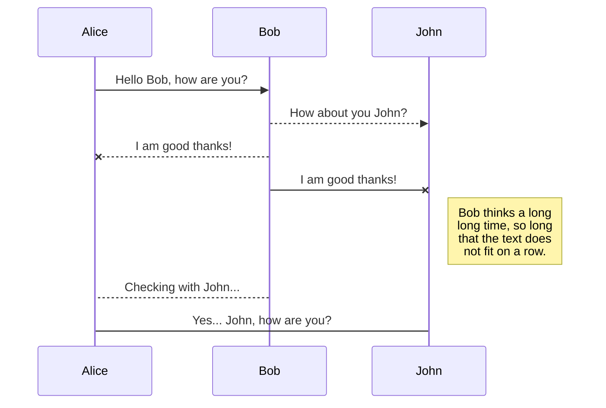
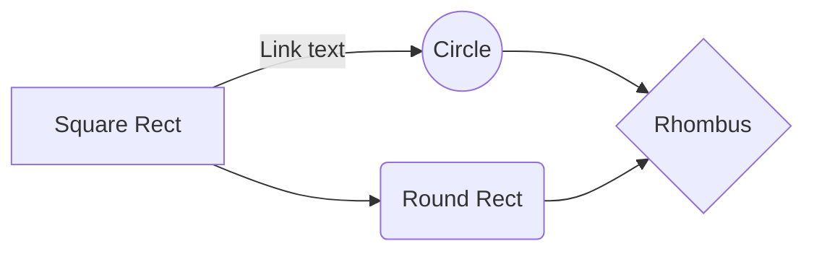

# AppviaMaps - Demo Project

This is a demo project that show how to deploy a containerised application into Appvia Wayfinder, making public cloud services easily consumable, securely and at scale.

The following instructions will walk  through getting going from scratch with Appvia Wayfinder. 

 1.  Getting an Appvia Wayfinder instance through cloud marketplace
 2. Configuring your Wayfinder instance ready for teams to start coding
 3. Configure your cloud account
 4. Configuring users
 5. Configuring your external DNS
 3. Team workspace setup
 6. Creating a Workspace
 7. Creating a cluster plan
 8. Create a Kuernetes cluster
 9. Deploy your application
 10. Build the frontend container
 11. Build the backend services container
 12. Create the Kubernetes configuration files
 13. deployment.yaml
 14. service.yaml
 15. ingress.yaml
 16. Running your application

# Getting an Appvia Wayfinder instance through cloud marketplace

The easiest way to get hold of an Appvia Wayfinder is to create a managed Wayfinder service through either Microsoft Azure or Amazon AWS marketplace. 

## Microsoft Azure
Head over to the Azure marketplace to install a Wayfinder instance within your Azure account. You can use an existing account or sign up for some free compute services. Appvia provide a free tier of services that will enable you to run this demo without incurring charges.  
https://azuremarketplace.microsoft.com/en-us/marketplace/apps/appvialtd.wayfinder?tab=overview

Follow the instructions from the marketplace page to create a Wayfinder instance. There's a video on the main marketplace page that takes you through the steps to get up and running. 

## Amazon AWS
We'll come back to this service. 

# Configuring your Wayfinder instance ready for teams to start coding

Once you have a basic Wayfinder instance up and running there are some important steps that a Wayfinder administrator must complete to make the platform vilable to end users to start creating resources. 

##  Configure your cloud account
Wayfinder has been installed into your public cloud of choce either through a cloud marketplace or a manual install. Wayfinder is a control plane for creating anad managing resources on **any cloud**. For Wayfinder to create services in your public cloud, it **must** have access to that coud account with roles that enable Wayfinder to create and manage resoruces.    

The marketplace install will have installed a Wayfinder instance and exported the credentials used into the properties of the markeplace application intall. e.g. Azure marketplace will have created wayfinder as a "managed application", click into that managed application in the Azure portal and click on the "Parameters and Outputs" link on the left hand navigation pane to show the login url, localAdmin user details and temporary password. 

**Log into your Wayfinder instance using these credentials.** This will take us to the landing page as a Wayfinder 'localAdmin' administrator user. We will use this user to get up and running.

**Click on the quickstart page tile "Connect your cloud accounts"**

Here we can configure a cloud account onto one of the three clouds that you want to start creating clusters and resources. Clicking on the "Connect Account" button on the top right we are presented with a choice of two types of accounts that can be configured:

**Connect an existing account**
This choice allows us to bring an exiting account under the control of Wayfinder, where all clusters and cloud resources will be created. 

**Use multi-account automation**
This choice allows us to bring an organizational account into Wayfinder. This choice will allow Wayfinder to create brand new isolated cloud accounts on your behalf into which Wayfinder will create resources, This allows futher secure isolation with many teams having resources within individual cloud accounts managed by Wayfinder. 

## SmartyPants

SmartyPants converts ASCII punctuation characters into "smart" typographic punctuation HTML entities. For example:

|                |ASCII                          |HTML                         |
|----------------|-------------------------------|-----------------------------|
|Single backticks|`'Isn't this fun?'`            |'Isn't this fun?'            |
|Quotes          |`"Isn't this fun?"`            |"Isn't this fun?"            |
|Dashes          |`-- is en-dash, --- is em-dash`|-- is en-dash, --- is em-dash|

## KaTeX

You can render LaTeX mathematical expressions using [KaTeX](https://khan.github.io/KaTeX/):

The *Gamma function* satisfying $\Gamma(n) = (n-1)!\quad\forall n\in\mathbb N$ is via the Euler integral

$$
\Gamma(z) = \int_0^\infty t^{z-1}e^{-t}dt\,.
$$

> You can find more information about **LaTeX** mathematical expressions [here](http://meta.math.stackexchange.com/questions/5020/mathjax-basic-tutorial-and-quick-reference).

## UML diagrams

You can render UML diagrams using [Mermaid](https://mermaidjs.github.io/). For example, this will produce a sequence diagram:

And this will produce a flow chart:

